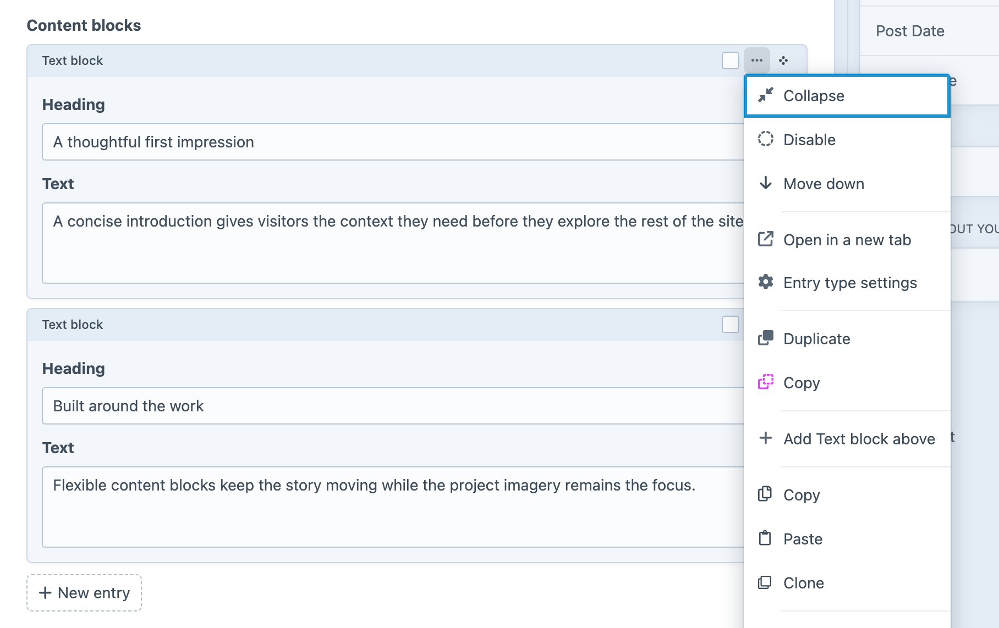

<!-- feature-intro -->
Smith adds copy, paste, and clone tools to Craft Matrix fields. Reuse a carefully configured block within an entry or carry it to another compatible field without rebuilding every value.
<!-- feature-intro-end -->

<!-- feature-section media-size="large" media-shadow="false" -->
## Copy, paste and clone blocks

Copy a Matrix block, paste it into a compatible field, or clone it in place. Complex blocks with several fields become practical starting points instead of a sequence of manual selections and duplicated values.

<!-- feature-section-end -->

<!-- feature-section -->
## Native Matrix workflow

Smith adds its actions to the controls editors already use rather than creating a separate content store. The resulting blocks remain ordinary Craft Matrix entries ready for further editing.
<!-- feature-section-end -->
